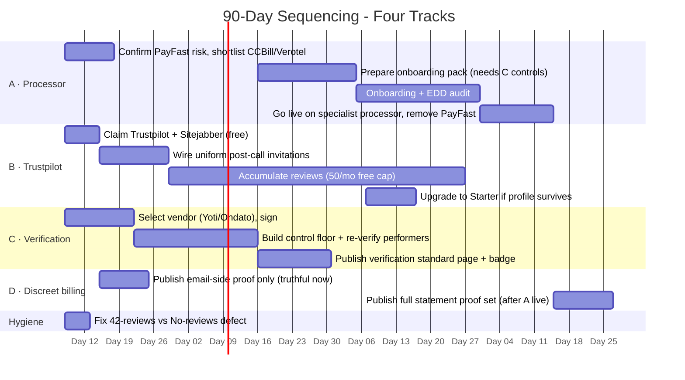

# gentlemens-place-ux-technical-audit.md

## Confirmed Business Model

**thegentlemensplace.eu is a live, functioning adult-entertainment platform - private phone sex, live video chat, and voice calls with performers, billed pay-per-minute via credits.** It is not a menswear, grooming, or lifestyle brand despite the name. This was confirmed directly on the live site (title tag, meta description, JSON-LD schema, page content) and corroborated by Google indexing.

- **Primary offer**: 1-on-1 private calls (voice or video) with "verified" performers. Credit packages: €9.99 (86 credits), €21.00 (200+10 bonus, "Most Popular"), €50.00 (520+20 bonus). 1 credit = 1 minute; rates vary per performer (3-6 credits/min observed).
- **Market/language**: Multilingual with proper hreflang for EN, FR, DE, ES, IT, PL, NL, PT - targeting the EU broadly, not a single country. Default language is English.
- **Payment**: PayFast (a South African payment gateway) - unusual choice for an EU-facing `.eu` domain; suggests the operator is South African (confirmed by FPB registration note and the site being "designed & maintained by Lex Digitals," a South African agency).
- **Platform**: Custom-built (no Shopify/WooCommerce/Wix signature). Static asset paths (`/Assets/css/main.css`, `/Assets/js/main.js`), PHP session cookies (`PHPSESSID`), and a bespoke `age_confirmed` cookie point to a hand-rolled PHP application, not a template SaaS platform.
- **Compliance posture**: Age gate, RTA label, 18 U.S.C. 2257 page, FPB (South Africa) registration notice - standard adult-industry compliance signals are present.

## Critical Flow Tested: Homepage → Performer Profile → Registration

Homepage (age gate → cookie consent → hero) → performer card ("Sky Winters") → performer profile page → `/register`.

1. **Homepage**: Clear headline ("Where Desire Meets Discretion"), one-line value prop, primary CTA ("BECOME A MEMBER") and secondary ("SIGN IN") both visible without scrolling on desktop and mobile. Trust badges (100% Discreet, 900+ members, 4.9★ rating) sit directly under the fold.
2. **Performer profile** (`/performer/sky-winters`): Shows stats (136 calls, 15h31m talk time, 5.0 rating, 42 reviews), rate (6 credits/min), and a "JOIN NOW" CTA - but **no logged-out "Connect" button is rendered**, so a first-time visitor cannot see what the actual call-initiation experience looks like before committing to registration. This is a legitimate friction point: the homepage teases "CONNECT NOW" on performer cards, but clicking through to the profile removes that exact CTA for non-members and replaces it with a generic "JOIN NOW," a bait-and-switch in cadence that could raise unnecessary abandonment.
3. **Data inconsistency (trust risk)**: The performer header states "42 REVIEWS" but the "Member Reviews" section on the same page reads "No reviews yet - be the first to connect with Sky Winters." One of these numbers is fabricated or stale - a real reputational risk in an industry where trust signals are the primary conversion lever.
4. **Registration** (`/register`): Reasonably short form - username, email, password, DOB, two checkboxes (age confirmation + ToS/Privacy). No social login option, but the form itself is not a friction point; it completes in well under two minutes as advertised.

## Performance & Technical Health

- **Load time**: Excellent. DOMContentLoaded ~425ms, full load ~553ms on the homepage; only 14 resources / ~14KB transferred (gzip-compressed HTML, `no-store` cache headers on the document). No render-blocking or heavy-asset issues detected - this is a lightweight, well-built front end.
- **Console errors**: One 404 resource error on first homepage load (not reproduced on the performer or register pages; likely a missing icon/preloader asset variant - low severity, worth a quick fix but not a growth blocker).
- **Tracking**: Google Analytics 4 (`G-TRV7G9DE1N`) is wired with a consent-aware default (`analytics_storage: denied` until cookie consent), and fires correctly post-consent (confirmed via a `region1.google-analytics.com/g/collect` 204 response on the performer page).
- **Mobile responsiveness**: No horizontal overflow detected (`scrollWidth === windowWidth` at 375px). Homepage and performer page both render correctly at 375×667 with the primary CTA above the fold. Header elements (logo, "JOIN NOW", language switcher, hamburger icon) sit close together and the hamburger icon appears tight against the viewport edge in the screenshot - a minor visual crowding issue worth a design pass, but not a functional break.

## Indexing & SEO Hygiene

**On-page SEO is unusually strong for the category**: unique title tag, meta description, canonical tag, correct hreflang alternates for 8 languages, complete Open Graph/Twitter card tags, and three JSON-LD schema blocks (WebSite, Organization, FAQPage). Title tags and H1s are present and distinct on every page checked (homepage, performer profile, registration).

However, two findings materially limit growth from search:

1. **`site:thegentlemensplace.eu` shows the site is indexed** - homepage, all 8 language variants, the `/performers` hub, category pages, and individual performer profiles (e.g. `/performer/zonika`) all appear. Indexing itself is not the problem.
2. **Brand-name search collision is severe.** Searching "The Gentleman's Place thegentlemensplace.eu" returns **zero results for this site on page one** - it is entirely crowded out by unrelated, better-established brands sharing the name (an Instagram/TikTok menswear house with 11K followers, a US barbershop chain "The Gents Place," "Gentlemen's Barbershop"). This means the domain name itself is a competitive liability: any brand-name search a curious or returning visitor performs is far more likely to surface a men's clothing company than this site. This is a backlink/domain-authority gap, not an on-page defect - the technical SEO is already done; what's missing is off-page authority (backlinks, citations, branded search volume) to win the name collision.

## Prioritized Issues

| Priority | Issue | Evidence | Growth impact |
|---|---|---|---|
| High | Brand name collides with established, unrelated menswear brands in search | Zero page-1 results for site under its own brand name query | Paid/organic traffic driven by brand recall will leak to competitors' unrelated sites; any offline/word-of-mouth referral is at risk of never reaching the site |
| Medium | Reviews count mismatch on performer profile (42 reviews shown in stats, "no reviews yet" in reviews section) | Observed directly on `/performer/sky-winters` | Undermines the "verified/rated" trust pitch that is central to the value proposition in an industry that runs on trust signals |
| Medium | Logged-out performer profile removes the "Connect" CTA shown on homepage cards | Compared homepage card CTA vs. profile page snapshot | Breaks CTA continuity between discovery and profile; adds a moment of "wait, where did the button go" friction right before the registration ask |
| Low | One 404 console error on homepage first load | `list_console_messages` | Cosmetic/asset hygiene; unlikely to affect conversion but easy to fix |
| Low | Mobile header (logo + Join Now + language switch + hamburger) renders crowded near the viewport edge | Mobile screenshot at 375px | Minor visual polish item, not a functional blocker |

## What This Means for Growth Investment

The technical foundation is genuinely good: fast load times, clean on-page SEO, working analytics with consent handling, no horizontal-scroll or layout-breaking bugs on mobile, and a short, functional registration flow. **Traffic acquisition is not blocked by technical debt.**

The real constraint is brand discoverability: paid traffic and performance marketing will convert fine once visitors land, but any strategy relying on branded search, word-of-mouth, or offline recall competes directly with unrelated, larger brands using the identical name. Before scaling spend on awareness-driving channels (influencer, social, PR), this needs either (a) a distinctive brand modifier to disambiguate search (e.g. consistently pairing the name with a category term), or (b) an off-page SEO push (backlinks, directory citations, branded content) to establish domain authority under the current name. Separately, fixing the reviews-count inconsistency and restoring a visible "Connect" CTA on performer profiles are low-effort, high-trust-impact fixes that should happen before any paid traffic push, since they sit directly in the conversion path this business depends on.

---

# gentlemensplace-market-competitor-positioning.md.md

# The Gentleman's Place - Market & Competitor Positioning Research

> ⚠️ **Major pivot from the brief.** The brief assumed thegentlemensplace.eu was a men's fashion/grooming/lifestyle e-commerce shop. **It is not.** Direct reading of the site confirms it is an **adult entertainment platform** - private phone sex, live video chat and voice calls with verified performers, billed pay-per-minute via non-expiring credits, 18+ only, launched 2025 ("Est. MMXXV"). The competitor set below has been reframed accordingly to adult phone-sex / live-cam PPM platforms, European-focused where possible.

---

## 1. Niche & Target Market

### What the site actually is

| Attribute | Finding | Source |
|---|---|---|
| Business model | Pay-per-minute (PPM) adult phone sex + live video/voice chat; **no subscriptions**; users buy non-expiring credits (1 credit = 1 min connection) | thegentlemensplace.eu (read directly) |
| Positioning | "Where Desire Meets Discretion" - *refined, confidential, members-only, hand-picked*; gentleman's-club framing | Homepage hero |
| Performer roster | ~95 active performers, ~900 members claimed; categories: Chat, Roleplay, Fantasy, Couples, Mature, Fetish | /performers |
| Languages / markets | 8 European languages: EN, FR, DE, ES, IT, PL, NL, PT - explicit pan-European ambition | Language switcher |
| Pricing | Performers set 1-6 credits/min; credit packs from €13.47 / 10 cr (~€1.35/cr) up to ~€20.99 / 200+20 cr; payments via PayFast; credits never expire | Site + grok-extracted pricing |
| Compliance | Registered with the **Film & Publication Board of South Africa** (not an EU regulator) - suggests operator base / payment routing outside the EU | Age-gate footer |
| Tech / vendor | "Designed & Maintained by Lex Digitals" | Footer |

### Target market definition

- **Who:** Adult men (18+) seeking private, discreet one-to-one intimate connections - the positioning ("gentleman", "members only", "discreet") signals an aim at **older, professional, privacy-conscious men** who value discretion and a curated experience over volume/price.
- **Where:** Pan-European via 8-language localisation, but with no visible country-specific marketing or regulator alignment beyond South Africa.
- **What they pay for:** Voice calls and live video chat with "verified, hand-picked" performers - a **phone-first hybrid** that distinguishes it from cam-first competitors.

### Market size & attractiveness - handle with care

Solid, Europe-specific figures for the *phone-sex / live-cam* sub-segment **do not exist publicly**. What is available (and it conflicts):

| Metric | Figure | Source | Confidence |
|---|---|---|---|
| Global adult camming revenue | ~**$5.5B/yr** (2024-25); grew 175% from $2B in 2016 | camsrank.com / inside.theporn.com | Estimate, widely cited |
| Alt. global webcam-modeling valuation | **$10.4B** (2022) - conflicts with the $5.5B consensus | gitnux.org | Conflicting estimate |
| Europe share of global cams | ~**30%** (~$3.12B, tied to the higher $10.4B figure) | gitnux.org | One source, derived |
| Europe online adult entertainment (broad, incl. video) | **$33.2B** (2023) → **$61.6B** by 2034 at 5.9% CAGR | transparencymarketresearch.com | Broker report, broad category |
| Europe model concentration | Germany most active cam models in Europe (~756 online avg); Romania 2nd (~429) | camsrank.com | Directional |

**Read this as:** the niche is large and growing (multi-billion, high single-digit CAGR), but the *phone-sex + premium-discreet* slice TGP targets is unmeasured. Treat any TAM number as a loose ceiling, not a serviceable market. The premium-discreet angle is a positioning bet, not a validated segment size.

---

## 2. Competitor Analysis (5 competitors)

Competitors chosen as the closest analogues: two **phone-first** (Xpanded UK, NiteFlirt US), two **cam-first European multilingual** (XloveCam FR/EU, Visit-X DE), and one **broad marketplace** (AdultWork UK). All figures are **estimated** unless marked verified.

### Comparison matrix

| Competitor | Model & focus | Positioning | Pricing psychology | Content / SEO | Est. monthly visits (source) | Distribution channels |
|---|---|---|---|---|---|---|
| **AdultWork** (UK) | Marketplace: escorts + webcam + phone + SMS + movies + pics + blogs + shop | "Safe, anonymous environment" - utilitarian, everything-to-everyone | Free to browse; performers set PPM rates; platform takes commission | Blogs, "AW Insider" news/guides, deep category pages | **16.49M** (May '26, Semrush) - 69% direct, ~25% organic | Direct brand, organic, referral (ukpunning.com forums), blogs |
| **NiteFlirt** (US) | Phone-sex marketplace + cam; deep category taxonomy (fetish, BDSM, femdom, findom) | "Best Phone Sex and Chat" - marketplace of independent flirts | Performers set **$1.99-$3.99+/min**; "billable volleys" for texting ~$0.99/msg; discreet billing | Huge category-page SEO (dozens of fetish niches) | **860K** (May '26, Semrush) - ~84% direct | Direct brand, organic category SEO, performer self-promo |
| **XloveCam** (FR/EU) | Free-to-watch cams → PPM private shows; cam2cam | "Free sex cams & live webcam sex" - freemium, volume | Privates ~**$1.80/min** (from ~$0.80); pay-by-phone in AT, BE, DE, IT, PL; multilingual | Blog, "Livecam News", model profiles, PWA app; brand + long-tail SEO | **2.92M** (May '26, Semrush) - ~627K organic | Organic search, pay-by-phone (EU telcos), app, content |
| **Visit-X** (DE/EU) | Cams + videos + TV/livestream + magazine; gamified | "Erotic live sex & video portal" - entertainment hub | PPM privates ~**$1.33/min**; daily deals, spinwheel, contests | Magazine, ASMR girls, contests, daily-deal content engine | **647K** (May '26, Semrush) | TV/livestream, content, gamification, organic |
| **Xpanded** (UK) | Phone sex + live cam + **broadcast TV** + fan clubs + sex shop | "Hottest interactive adult entertainment" - mass-market UK babe channel | **95p/min** phone (95 credits; 1 cr = 1p); £40/call cap; bundles from £15; "30-50% savings" vs premium-rate framing | TV-driven; fan-club pages; Trustpilot reviews | **~415K** (Hypestat - weak source) | **Broadcast TV** (Sky 902, Freeview 671), fan clubs, shop, organic |
| *TGP (subject)* | Phone + video, curated small roster | *Premium / discreet / members-only* | 1-6 cr/min; €1.35/cr entry; non-expiring credits | **None visible** - no blog, no third-party coverage | **Negligible** - only own pages + 1 classified ad rank | Adult classifieds (kittyads.com) only - weak |

### Per-competitor detail

**AdultWork - the scale leader.** A two-decade-old marketplace that aggregates every adult service. Its dominance is **brand/direct traffic** (69% direct, 16.5M visits) - a retention engine, not an acquisition one. Positioning is deliberately neutral/utility ("safe, anonymous"), the opposite of TGP's premium framing. It wins on breadth and network effects (performers go where the buyers are). *Implication for TGP:* you cannot out-marketplace AdultWork on breadth; the only viable angle is the narrow premium slice it ignores.

**NiteFlirt - the phone-sex category owner (US).** The clearest structural twin to TGP: a phone-first PPM marketplace where independent performers set rates. Its strength is **category-page SEO depth** (femdom, findom, foot, feminization, smoking, latex - dozens of niche landing pages) and ~84% direct traffic from long-term regulars. Weakness: US-centric, English-only, mass-market visual treatment - no "premium/discreet" positioning, no European languages. *This is the closest model TGP should benchmark for product mechanics, and the clearest gap to beat on geography + positioning.*

**XloveCam - the European cam standard.** Multilingual (FR-rooted, pan-EU), freemium funnel (free public cams → paid privates), pay-by-phone integration with EU telcos (a real European distribution lever), and a content engine (blog, news, PWA app). ~627K organic visits on brand + long-tail terms. Premium-ish but cam-first, not phone-first, and not "discreet/members-only." *Implication:* the European multilingual + phone hybrid is genuinely under-occupied.

**Visit-X - the gamified German hub.** Cams + VOD + TV + magazine + contests + daily deals + ASMR. A content-and-gamification engine that drives engagement beyond the live session. ~647K visits. German/EU focus, mid-market pricing. *Implication:* shows how content + gamification extend LTV in this niche - a capability TGP entirely lacks.

**Xpanded - the broadcast-acquisition play.** Uniquely uses **linear TV (Sky/Freeview)** as a top-of-funnel acquisition channel into phone sex + cam, plus fan clubs and a sex shop for cross-sell. Mass-market ("cheap phone sex"), UK-only, English. Traffic estimate is weak (Hypestat ~415K, unverified). *Implication:* TV is a channel TGP can't/shouldn't replicate, but the cross-sell-ecosystem lesson (phone → fan club → shop) applies.

---

## 3. Market Gaps & Underserved Segments

### Positioning map (price/premium × channel focus)

| | **Phone-first** | **Cam-first** |
|---|---|---|
| **Premium / discreet** | 🎯 **TGP's target quadrant - largely empty.** NiteFlirt is phone-first but mass-market/US; Xpanded is phone+TV but cheap/UK. *No premium, multilingual, European phone+video hybrid exists.* | XloveCam is mid-premium but cam-first and freemium-public (not discreet) |
| **Mass-market** | Xpanded (UK TV), NiteFlirt (US marketplace) | AdultWork (everything), Visit-X (DE hub) |

**The empty quadrant is real but unvalidated.** Applying the "why doesn't anyone do this?" test: the premium-discreet European phone hybrid is open not because it's technically hard or proven-failed, but because incumbents grew up mass-market/English and never segmented upward. The risk is economic - premium phone sex is a thin slice and discretion-seekers may not pay a sustained premium. This is a bet, not a confirmed gap.

### Concrete gaps

1. **Premium / "gentleman's-club" positioning - uncontested.** Every competitor leads with "free," "cheap," "hottest," or utility/anonymity. *None* sells refinement, curation, or membership exclusivity. TGP owns this language by default - but owns no audience yet.
2. **European multilingual phone sex - open.** XloveCam/Visit-X are cam-first and multilingual; Xpanded/NiteFlirt are phone-first but English-only. A phone+video service in FR/DE/IT/ES/PL/NL is genuinely underserved.
3. **Curation over volume - open.** Competitors compete on roster size (thousands). TGP's "hand-picked, ~95 performers" quality-over-quantity angle has no direct rival - but needs proof (verification process, quality control) to be credible.
4. **Trust & external proof - everyone is weak, TGP weakest.** Only Xpanded surfaces a Trustpilot presence. TGP has *zero* third-party reviews, press, or forum mentions in search - a trust vacuum for a "discreet premium" brand that lives or dies on credibility.
5. **Content / top-of-funnel - TGP absent.** XloveCam (blog/news), Visit-X (magazine/ASMR/contests), AdultWork (Insider/blogs), NiteFlirt (category SEO) all run content engines. TGP has none - it relies on a single low-quality classified ad (kittyads.com) for discovery.

### Underserved audience segments

- **Older / professional European men who want discretion and recurring 1-to-1 relationships** - NiteFlirt's "long-term regulars" (84% direct traffic) prove this behaviour exists; no European premium player serves it.
- **Non-English European speakers** seeking phone (not cam) intimacy - FR/DE/IT/ES/PL/NL speakers have cam options but few phone-first options.
- **Privacy-anxious first-time buyers** - deterred by "free public cam" environments; a gated, members-only, discreet-billing offer addresses an unmet comfort barrier.

---

## 4. What Winning Looks Like - Success Patterns

The four patterns that separate the strongest players (AdultWork, NiteFlirt, XloveCam) from the weakest (TGP, Xpanded):

1. **Brand & direct-traffic dominance, not SEO acquisition.** AdultWork 69% direct / 16.5M; NiteFlirt 84% direct. This niche is **retention-led**: winners earn repeat visits and brand recall, not first-click search traffic. TGP currently has neither brand nor SEO - its single biggest structural deficit. *Winning move:* engineer retention (regulars, favourites, recurring billing) before chasing organic acquisition.

2. **A content / SEO engine for top-of-funnel.** XloveCam's 627K organic visits come from blog + news + model profiles + multilingual long-tail; Visit-X's magazine/ASMR/contests; NiteFlirt's deep category pages. Winners build topical authority; TGP has none. *Winning move:* a multilingual content + category-page program targeting long-tail transactional intent ("private [language] phone", "discreet [niche] cam", roleplay/fetish terms).

3. **A multi-product ecosystem that cross-sells.** AdultWork (webcam+phone+SMS+movies+pics+shop+blogs), Xpanded (phone+cam+TV+fan clubs+shop), Visit-X (cams+VOD+TV+magazine+deals). Winners monetise the same user across formats; TGP is single-product (phone/video only). *Winning move:* add fan-club subscriptions, content libraries, or messaging to raise LTV without abandoning the premium frame.

4. **Trust signals & social proof.** Performer ratings/reviews, verified badges, and (for Xpanded) external Trustpilot. TGP has internal ratings but **zero external trust footprint** - fatal for a "discreet premium" promise. *Winning move:* verification transparency, third-party reviews, discreet-billing proof, and a public trust/compliance posture (note: TGP's only regulator shown is South Africa's FPB - a European regulator alignment would materially help EU trust).

---

## 5. Recommended Actions (ordered by leverage)

1. **Close the trust vacuum first (highest leverage, lowest cost).** Add external review presence (Trustpilot), publish a verification/quality standard for "hand-picked" performers, surface discreet-billing proof, and clarify compliance posture for EU markets. A premium-discreet brand with no third-party proof cannot convert. *Owner: marketing + legal. Success: ≥10 verified external reviews + an EU compliance statement within 90 days.*
2. **Build the retention engine before acquisition.** Favourites, "regular" relationships, recurring credit auto-top-up, performer availability alerts. The niche rewards direct/return traffic; TGP's 900 members are the asset to grow, not the top of funnel. *Owner: product. Success: direct/return traffic share rising toward 50%+.*
3. **Launch a multilingual content + category-SEO program.** Long-tail transactional pages in all 8 languages (roleplay, fetish, mature, couples, "discreet phone [language]", "private video [niche]") plus a blog/guide content engine. This is the cheapest path to organic visibility TGP currently lacks entirely. *Owner: content/SEO. Success: first 100k organic visits within 6-9 months.*
4. **Extend the product to raise LTV - without losing the premium frame.** Add fan-club subscriptions or a content library so a member monetises beyond the live minute. Keeps the "members-only" promise while adding recurring revenue. *Owner: product. Success: ≥20% of paying members with a recurring add-on.*
5. **Validate the premium-pricing bet.** Test whether curated/premium performers at the top of the 1-6 cr/min range convert and retain better than volume. The empty quadrant is a hypothesis; prove the unit economics before scaling acquisition spend. *Owner: growth. Success: A/B test on premium-tier performers showing ≥20% higher LTV.*

---

## Open Questions / Data Limits

- **No reliable Europe phone-sex TAM.** Camming figures ($5.5B-$10.4B global, ~30% EU) are the closest proxy and they conflict; the premium-discreet slice is unmeasured. Treat market size as directional only.
- **TGP traffic is unmeasurable.** Too new/small for Semrush; the only external signal is one kittyads.com classified. Real member/traffic numbers must come from the operator's own analytics.
- **Xpanded traffic is a weak Hypestat estimate (~415K), unverified by Semrush.**
- **TGP payment routing (PayFast, South African FPB registration)** raises unverified questions about EU payment reliability and chargeback risk that affect conversion - needs operator confirmation.
- **Performer supply economics** (payout %, how "hand-picked" is enforced) are not visible and determine whether the curation positioning is sustainable.

## For Further Research (cross-functional)

- **Technical/UX audit of thegentlemensplace.eu** (separate workstream) - the conversion path, age-gate, credit purchase flow, mobile experience, and page speed directly determine whether the premium positioning converts. Hand off this positioning analysis to pair with the live audit.
- **Payments & compliance specialist** - validate EU payment processing, chargeback exposure, and regulator alignment (the South Africa FPB angle is unusual for an .eu-domain pan-European brand).
- **Reverse-engineering specialist** - reconstruct how XloveCam/Visit-X built their organic authority (backlinks, content cadence, multilingual structure) to template TGP's SEO program.

---

# performer-verification-standard.md

# Performer Verification Standard - What to Build and Publish

A credible, publishable performer verification standard for an adult live phone/video platform serving EU customers is governed primarily by **card-network rules** (Mastercard and Visa), not by EU consumer-protection law. The EU Digital Services Act and UK Online Safety Act mostly regulate *user* age checks (keeping minors off the site), while *performer* verification - proving every depicted person is 18+, has consented, and is who they claim to be - is the obligation the card networks enforce on the merchant directly. Get the card-network floor right first; the public-facing standard is then a trust and marketing layer on top of it.

This report covers: (1) the card-network hard floor, (2) EU/UK regulatory direction, (3) the components a published standard must contain, (4) what to publish vs keep internal, (5) competitor examples of good public presentation, and (6) verification vendors that accept adult platforms with pricing.

---

## 1. The Hard Floor: Card-Network Requirements

These define what the platform **must** do regardless of marketing. Non-compliance risks loss of card acceptance, acquirer penalties, and Specialty Merchant Registration revocation.

### Mastercard - AN 5196 (effective 15 October 2021)

Mastercard's "Revised Standards for New Specialty Merchant Registration Requirements for Adult Content Merchants" applies to non-face-to-face adult content/service merchants. Requirements are codified in the Security Rules and Procedures - Merchant Edition manual (Chapter 9, current Feb 2025) and enforced via Specialty Merchant Registration.

| Requirement | What it means in practice |
|---|---|
| **Age + identity verification of every depicted person** | Government-issued ID, preferably via specialised third-party service, for all performers/individuals shown in content. |
| **Verification of all uploaders/generators** | Only verified third-party content providers may upload; written agreements required. |
| **Documented consent** | Written agreements covering consent and verification, retained on file. |
| **Pre-publication content review** | Content screened before it goes live. |
| **Real-time monitoring & removal** | For live streaming, ongoing monitoring with ability to remove content in real time. |
| **Complaint / takedown process** | Process to block/remove illegal or non-consensual content, generally within 7 business days. |
| **Appeals process** | A depicted person can appeal to have content removed. |
| **Monthly acquirer compliance reporting** | Acquirer reports flagged content, complaints, and actions to Mastercard monthly. |
| **Anti-trafficking / anti-abuse policies** | Explicit policies against trafficking and abuse. |
| **No marketing implying illegal content** | Marketing must not suggest illegal/non-consensual material. |

*Sources: Mastercard newsroom (April 2021 announcement); official AN 5196 PDF hosted by Segpay; Mastercard SPME Manual (Feb 2025), Chapter 9.4.1.*

**Fees (2026 update):** $1,000 annual Specialty Merchant Registration fee per merchant, plus ~$0.02 per purchase + 10 bps on volume for adult/specialty categories.

### Visa - Visa Integrity Risk Program (VIRP, effective 1 May 2023)

VIRP replaced the Global Brand Protection Program (GBPP). Adult content merchants (MCC 5967) and dating/escort services (MCC 7273) are classified **Tier 1 High Integrity Risk (HIR)**.

| Requirement | What it means |
|---|---|
| **Acquirer registration + enhanced due diligence** | Acquirer must register the merchant and perform EDD. |
| **Mandatory age verification** | Robust methods that meet/exceed jurisdictional legal standards; self-declaration alone is insufficient. |
| **Content moderation + transaction monitoring** | Ongoing monitoring of content and transactions for prohibited/illegal activity. |
| **Ongoing monitoring** | Continuous oversight; violations can lead to acquirer penalties or network removal. |

*Sources: Visa VIRP guide; Segpay, LegitScript, Onlayer secondary analyses. Official Visa rules live in acquirer guides and bulletins.*

> **Bottom line:** Both networks require, at minimum, government-ID age+identity verification of every performer, documented consent, pre-publication and live content review, and a complaint/takedown+appeals process. A platform that cannot demonstrate these to its acquirer cannot legally maintain card acceptance.

---

## 2. EU / UK Regulatory Direction (User-Facing, Not Performer-Facing)

This is the directional context. It governs **user** access (keeping minors out), which is a separate workstream from performer verification - but a complete trust program addresses both, and the EU framework increasingly sets the public expectations users will judge you against.

### EU Digital Services Act (fully applicable 17 Feb 2024)
- **Art. 28** requires platforms accessible to minors to implement appropriate, proportionate minor-safety measures; **Art. 35** lists age verification among VLOP risk mitigations. Self-declaration is deemed insufficient.
- **Enforcement opened May 2025** against Pornhub, XNXX, XVideos, and Stripchat for inadequate age-assurance measures.
- **EU age-verification blueprint** published 14 July 2025; feature-ready app 15 April 2026 (piloted in Denmark, France, Greece, Italy, Spain); Commission **Recommendation (29 April 2026)** urges Member States to make privacy-preserving 18+ proof available to all citizens by **31 December 2026**.
- **National layer:** France's SREN Act (technical standards enforceable since Jan 2025, penalties up to 4% turnover) adds stricter rules. Other Member States vary.
- **Trusted flaggers (Art. 22):** designated entities whose illegal-content notices platforms must prioritise.

### UK Online Safety Act 2023 (Ofcom)
- Mandates **"highly effective" age assurance (HEAA)** on adult/pornography sites. Part 5 (provider-published porn) from 17 Jan 2025; all services allowing pornography by **25 July 2025**.
- Accepted methods: facial age estimation, photo-ID scans, credit/bank-card checks, digital ID, mobile authentication (privacy-preserving where possible).
- **Penalties:** up to £18 million or 10% of global annual revenue. **First fine: £1.35 million** (Feb 2026, to 8579 LLC for non-compliance).

> **Implication for thegentlemensplace.eu:** The DSA/OSA obligations are about *users* proving they are adults before accessing content - a separate but parallel investment. The performer verification standard is the card-network obligation. Both should be visible on the site, but they are distinct pages with distinct evidence.

---

## 3. Components a Published "Performer Verification Standard" Must Contain

This is the core deliverable: the components the public page should cover. Each maps to a card-network requirement and a trust signal.

| # | Component | What it states | Driven by |
|---|---|---|---|
| 1 | **Age verification** | Every performer is verified 18+ using a government-issued photo ID (passport, national ID, or driving licence), checked by a third-party verification service. | Mastercard / Visa / 2257 |
| 2 | **Identity verification** | ID is matched to the performer via a liveness/selfie check (face match against the ID), so the person on camera is the person on the document. | Mastercard / Visa |
| 3 | **Documented consent** | Each performer signs a written agreement covering consent, verification, and content rights before going live; retained on file. | Mastercard AN 5196 |
| 4 | **Pre-publication & live review** | Performer profile and content reviewed before publication; live streams monitored in real time with ability to remove. | Mastercard AN 5196 |
| 5 | **Re-verification cadence** | Periodic re-verification (e.g., on a set cadence and on any profile/identity change, plus random live face checks during streams). | Best practice (Stripchat, LiveJasmin do this) |
| 6 | **Multi-performer rule** | If a stream features more than one person, every depicted individual is individually verified - no unverified third parties on camera. | Mastercard ("every depicted person") |
| 7 | **Complaint & takedown process** | A route for any depicted person or user to report non-consensual, underage, or illegal content, with a defined resolution window (Mastercard: 7 business days) and an appeals path. | Mastercard AN 5196 |
| 8 | **Anti-trafficking / anti-coercion** | Explicit policy against trafficking, coercion, and exploitation; how reports are handled. | Mastercard AN 5196 |
| 9 | **Data handling** | What verification data is collected, who processes it (named vendor), how long it is retained, and how performers can request deletion. | GDPR + trust |
| 10 | **Verification badge / signal** | What the user actually sees on a verified performer's profile (a "Verified" badge or label) so the standard is visible at the point of decision. | Trust / conversion |

---

## 4. What to Publish Publicly vs Keep Internal

| Publish publicly (on a dedicated page) | Keep internal (referenced but not exposed) |
|---|---|
| The 10 components above, in plain language | Exact vendor contract terms, API details |
| Name of the verification vendor used (e.g., "Powered by Yoti") | Copies of performers' IDs / selfie images |
| That IDs are checked by a third party and not stored in plain text | Retention schedule specifics beyond the public summary |
| The complaint/takedown route and response window | Internal review checklists and SLA internals |
| The re-verification cadence (e.g., "re-verified every X months and on change") | Individual performer verification status history |
| The anti-trafficking stance and reporting route | Acquirer compliance reports (sent to Mastercard, not public) |
| A "Verified" badge visible on each verified performer's profile | The underlying verification records |
| Data-handling summary (GDPR-aligned: what, who, how long, deletion right) | Full data-processing agreements |

**Rule of thumb:** Publish the *standard and the promise*; keep the *evidence and the records*. Users need to see what "verified" means and that a real third party stands behind it. They must never see another person's ID.

---

## 5. Competitor Examples of Good Public Presentation

Three concrete examples, ranked by how much they publish publicly.

### 🥇 Best public page - xHamster (xhamster.com/info/trust-and-safety)
A dedicated, detailed public Trust & Safety page covering: platform documentation (Terms, Privacy, DMCA, Parental Controls), zero-tolerance for illegal/CSAM/non-consensual content, that **only verified uploaders (individuals and legal entities) may upload**, proactive + reactive moderation (AI + manual), and a separate DSA transparency-report page. This is the gold-standard structure for a public trust page in this vertical. *Confirmed by direct read of the live page.*

### 🥈 Most documented performer flow - Stripchat (support.stripchat.com)
Public help-centre articles detail the exact performer verification process: government ID (both sides) + a colour photo of the performer holding the ID next to their face alongside a handwritten note with the current date and exact username + a real-time selfie/face scan; up to 6 people per account, each individually verified; ~24h approval; ongoing random live face checks during streams. Notably, **no public verification badge** is shown to viewers - verification is internal/KYC only. This is the most transparent *process* disclosure but the least visible *user signal*.

### 🥓 Strong user-visible signal - AdultWork (adultwork.com/AgeVerification.asp + help centre)
Uses **Yoti integration** for age/identity verification (facial scan + ID), plus a "verification photo" (selfie holding a handwritten sign reading "AdultWork.com", UserID, and date). Produces a **"Verified Member" status** users can see. Explicitly framed around UK Online Safety Act compliance. References 18 U.S.C. § 2257 record-keeping. 48-hour processing.

### Also worth noting
- **NiteFlirt** uses third-party vendor **Persona** (ID front/back + live liveness face scan), with the full process published openly in its Help Center (no login required) - a strong example of *transparency about the method*.
- **LiveJasmin** requires ID + selfie holding the ID, third-party automated checks, and will re-verify at any time including for "Hide My Face" performers - but publishes this in FAQ/Privacy Policy rather than a dedicated trust page.

> **Pattern:** The platforms that convert trust best combine (a) a dedicated public trust/verification page, (b) a named third-party vendor, and (c) a visible "Verified" badge on each performer. The platform's current "42 REVIEWS / No reviews yet" inconsistency is the opposite of this - it undercuts the trust pitch at the exact moment a user is deciding.

---

## 6. Verification Vendors That Accept Adult Platforms (+ Pricing)

| Vendor | Serves adult industry? | Evidence | Rough pricing per check |
|---|---|---|---|
| **Yoti** | ✅ Yes - explicit | 100+ porn brands; Pornhub uses Yoti for document checks; OnlyFans testimonial; dedicated adult page (yoti.com/adult-content-age-verification) | **Custom (contact sales).** Component estimates: Liveness ~£0.15, Document authenticity ~£0.30, Face match ~£0.25. Industry-wide ref ~$0.12/check. |
| **Ondato** | ✅ Yes - explicit | Lists "Adult Content & Gambling" as an industry; "OnAge" tool for adult platforms; OnlyFans case study | **€0.50-€1.40** per verification (volume-dependent; <€1 at scale) |
| **VerifyMy / VerifyMyAge** | ✅ Yes - explicit | Dedicated adult-entertainment industry page; serves Gamma Entertainment; AVPA member | **Unknown** (not published) |
| **SumSub** | ⚠️ General KYC, no confirmed adult clients | Strong in iGaming/fintech; no adult platform case studies found | $1.35 (Basic) / $1.85 (Compliance) per verification; monthly min ~$149-$299 |
| **Jumio** | ⚠️ General, no explicit adult page | Referenced in adult-access discussions but no adult clients/pages confirmed | **Unknown** |
| **Veriff** | ⚠️ General, no adult-specific mentions | No adult industry clients or case studies found | Self-serve: Essential $0.80, Plus $1.39, Premium $1.89 (monthly mins $49-$209) |

**Recommendation:** Shortlist **Yoti** and **Ondato** first - both explicitly serve adult platforms, have named adult clients (Pornhub, OnlyFans), and offer the ID + liveness + face-match flow the card networks require. Yoti additionally carries strong UK/EU regulatory credibility (used for Ofcom-compliant age assurance), which helps the parallel user-verification workstream. VerifyMy is a credible third option for adult-specific age assurance. Treat SumSub/Jumio/Veriff as fallbacks only - confirm adult acceptance in writing before relying on them, as their public posture is general-purpose.

> **Pricing caveat:** All vendor pricing is usage-based and volume-discounted; the figures above are published self-serve/list rates or third-party estimates, not negotiated quotes. Final cost depends on check volume, method mix (ID vs facial age estimation vs liveness), and contract terms. Confirm directly with each vendor.

---

## 7. What This Means for thegentlemensplace.eu - Recommended Actions

1. **Build the internal verification process to the card-network floor first.** Every performer: government-ID age+identity check via a third-party vendor, liveness face match, signed consent agreement, pre-publication profile review, real-time stream monitoring, and a 7-business-day complaint/takedown+appeals route. This is non-negotiable for keeping card acceptance.
2. **Pick a named vendor - Yoti or Ondato - and publish the partnership.** A named third party on the public page is the single biggest trust lever and the main thing competitors with strong trust pages do that this site currently does not.
3. **Publish a dedicated /trust-and-safety or /verification-standard page** covering the 10 components in §3, structured like xHamster's. Keep it separate from the user age-verification page (DSA/OSA) - they are distinct obligations.
4. **Add a visible "Verified" badge to every verified performer profile.** Make the standard visible at the point of decision. This directly fixes the trust-signal gap the live audit found (the "42 reviews / No reviews yet" inconsistency) by giving users a concrete, consistent signal instead.
5. **Fix the reviews inconsistency as part of the same trust pass.** A verification standard loses credibility if other trust signals on the same profile contradict themselves. Either surface real reviews or remove the "42 reviews" stat - do not show both.
6. **Separate the user age-verification workstream.** DSA/UK OSA user age checks are a parallel investment (and a regulatory risk with real fines). Scope it separately; Yoti can serve both performer KYC and user age assurance, which is an efficiency worth exploring.

---

## Open Questions / What Could Not Be Verified

- **VerifyMy and Jumio pricing** - not published; marked unknown rather than estimated.
- **SumSub / Jumio / Veriff adult-industry acceptance** - no confirmed adult platform clients or dedicated adult pages found in public sources; confirm in writing before relying on them.
- **Visit-X performer verification detail** - no detailed public policy found (only an "Age check" support article); treated as not publicly available.
- **Exact negotiated vendor cost** - all figures are list/estimate; real cost requires a sales conversation keyed to this platform's check volume.
- **This platform's current acquirer and its specific attestation requirements** - card-network rules are implemented through the acquirer, who may add requirements beyond the network minimum. Confirm with the acquirer (currently PayFast, a South African gateway) what performer-verification attestation it requires, as PayFast's adult-merchant compliance posture is itself unverified here.

*All regulatory and card-network facts above are sourced from primary or high-credibility secondary sources (Mastercard newsroom + official PDF + SPME manual; Visa VIRP guide; EU Commission digital-strategy pages; Ofcom/gov.uk; vendor official sites). Anything not directly confirmed is labelled unknown.*

---

# trustpilot-feasibility-adult-platform.md

# Trustpilot Feasibility for thegentlemensplace.eu

**Verdict: GO-WITH-CAUTION** - A Trustpilot business profile is obtainable and operable for this platform, but the live-video element sits inside a grey zone where Trustpilot *can* remove profiles, and has done so to comparable sites. Lead with the phone/voice-chat framing, start on the free plan, and hold a confirmed fallback in parallel.

---

## 1. What Trustpilot's own policy actually says

I read the current **Action We Take** policy (v3, March 2026) and the **Guidelines for Businesses** (May 2025) directly. Two clauses matter.

### The "Ineligible businesses" clause (the one that can remove you)

Trustpilot is an *open platform* - anyone can review any business, and a review auto-creates a profile. But it reserves the right to refuse to host certain businesses:

> "There are certain types of businesses that don't belong on Trustpilot… These are typically businesses that don't align with our values or ethical standards… **Trustpilot may consider a business to be ineligible even if the product or service offered is legal in the market in which the business operates.**"

The listed ineligible categories that could touch this business:

- **"Host, offer or produce any sexual abuse or explicit imagery, including any material that presents children or animals in a sexual or illegal manner."**
- **"Promote escort services, mail-order brides, prostitution or any form of forced labour or human trafficking."**
- "Are engaged in an industry, practice or jurisdiction that doesn't align with our values and ethical standards…"

Enforcement: *"When we detect an ineligible business, we may close the profile for new reviews, and/or remove and block the business from our platform."*

### The content clause (applies to reviews and replies, not the business itself)

The **Guidelines for Businesses** prohibits *content* containing "severe profanity, disturbing material, **explicit adult content, nudity or pornography**." This governs what reviewers write and what the business replies - it does **not** ban the business category. Reviews describing adult services are fine; explicit images/links in reviews or replies are not.

### The crucial distinction

Trustpilot bans **escort services / prostitution / mail-order brides** (in-person sexual services) and **explicit imagery**. It does **not** ban adult phone/voice entertainment. A digital, no-meeting, pay-per-minute phone-and-video-chat platform is *not* escort or prostitution - that is the platform's defensible line. The risk concentrates entirely on the **"explicit imagery"** wording as it applies to the live-video feature.

---

## 2. Empirical check: do comparable adult platforms have live Trustpilot profiles today?

I checked each platform's live Trustpilot page on 2026-07-08. The picture is **inconsistent enforcement, not a categorical ban** - which is itself the key finding.

| Platform | Service type | Trustpilot status | Score / reviews | Claimed? |
|---|---|---|---|---|
| **NiteFlirt** | Phone sex / voice flirt | ✅ **LIVE** | 2.8/5, active reviews through May 2026 | ✅ Yes - business is replying to reviews |
| **Xpanded** | UK phone-sex chat line | ✅ **LIVE** | 3.0/5, 2 reviews | ❌ Unclaimed |
| **Visit-X** | German explicit cam site | ✅ **LIVE** | 2.8/5, 3 reviews | - |
| **Xlovecam** | Explicit cam site | ✅ **LIVE** | 2.6/5, 9 reviews (through Apr 2026) | - |
| **Tryst.link** | Escort directory | ✅ **LIVE** | 2.4/5, reviews describe escorting | - |
| **AdultWork** | Escort / sex-work directory | ❌ **REMOVED** | "Goes against our guidelines" | - |
| **LiveJasmin** | Explicit cam site | ❌ **REMOVED** | "Goes against our guidelines" | - |

**What this proves:**
1. **Phone-sex platforms survive and are claimed** - NiteFlirt (the closest analogue to this business) is live, claimed, and actively replying to reviews. This is the strongest precedent that the core service is admissible.
2. **Even explicit cam and escort sites currently survive** (Visit-X, Xlovecam, Tryst) - so removal is not automatic or categorical.
3. **But removals do happen** to direct competitors (AdultWork, LiveJasmin) - enforcement is *reactive*, likely triggered by whistleblower reports or high-profile targeting, not a published category sweep.
4. The line between "live" and "removed" is not predictable from the service type alone. **That unpredictability is the core risk.**

---

## 3. What this means specifically for thegentlemensplace.eu

This platform is "private phone sex + live video/voice chat." It straddles the two precedents:

- **The phone/voice-chat side = NiteFlirt / Xpanded precedent → clearly admissible.** This is the safe core.
- **The live-video side = edges toward the "explicit imagery" clause** that got LiveJasmin removed - though Visit-X and Xlovecam (also explicit cam) are still live, so it is not a guaranteed removal.

The platform's structural defenses (all in its favour):
- It is **digital-only, no in-person meeting** - so it is *not* escort/prostitution, the hardest ban. This is the single most important distinction.
- It is **premium/discreet, "gentleman's club" framing** - not overtly pornographic in branding.
- It bills via **pay-per-minute credits** - a clean transactional record that makes every customer a genuine, reviewable "experience," which is exactly what Trustpilot requires for invitations.

**Net read:** The profile is very likely to be *created* and *probably* to persist, because the phone-entertainment framing matches the surviving precedent. The residual risk is a future removal if Trustpilot's Content Integrity team reviews the live-video feature under the "explicit imagery" wording - a risk that cannot be fully eliminated and that has no reliable appeal.

---

## 4. Implementation path (start free, then decide)

### Step 1 - Claim the profile (free, no credit card)
1. Go to `business.trustpilot.com` → sign up with a business email **on the thegentlemensplace.eu domain** (domain/email verification is how ownership is proven - a generic Gmail will not let you claim the domain).
2. Claim the profile page for `thegentlemensplace.eu`. Edit the profile description to emphasise the **discreet phone & voice-chat entertainment service** - avoid explicit/sexualised language and imagery in the profile itself (the content clause applies here).
3. Categorise under **Adult Entertainment** (the live, populated category Trustpilot maintains).

### Step 2 - Collect the first reviews on the Free plan
The **Free plan** (confirmed on the live pricing page) includes:
- **50 automated review invitations per month**
- Claim & customise profile, reply to reviews, flag reviews
- 1 review-collection widget, 1 user, 1 domain, 10 eCommerce integrations
- No cost, no credit card, reviews stay even if you never pay

**How automated invitations work for a credit-billing platform:** Trustpilot's invitation API / integrations send a review-request email after a defined trigger. For this site, the trigger is **end of a paid call/session** (a credit-consuming event = a genuine, verifiable customer experience). Each invitation creates the "Verified" link between reviewer and business. This is the correct, compliant hook.

### Step 3 - Only upgrade once the profile survives and accumulates
Do **not** pay until the profile has persisted 60-90 days and has real reviews. If it gets removed early, you have lost nothing on the free plan. Paid tiers (12-month commitment):

| Plan | Price (per domain, billed annually) | Invitations/mo | Key additions |
|---|---|---|---|
| Free | $0 | 50 | Claim, reply, flag, 1 widget |
| Starter | $99/mo | 100 | 2 widgets, marketing assets *(small business ≤$5m revenue only)* |
| Plus | $319/mo | 300 | 10 widgets, 3 users, 59 integrations |
| Premium | $799/mo | 1,000 | 21 widgets, 10 users, API add-on |
| Enterprise | Contact sales | Unlimited | Full analytics, SSO, CSM |

For this business the realistic landing tier is **Free → Starter** (or Plus if review volume justifies it). The widgets (TrustBoxes) that let you display the TrustScore *on thegentlemensplace.eu itself* - the actual conversion lever - only start at Starter.

---

## 5. The #1 compliance risk: review gating

Trustpilot is explicit and strict here. Violating these rules is the fastest way to get a **Consumer Warning** (TrustScore hidden, account downgraded) or full removal - independent of the adult-content question.

From the Action We Take policy, businesses must:
- **Invite everyone the same way** - "Businesses must not 'cherry pick'… this is illegal." You cannot invite only happy customers.
- **Invite consistently and fairly** - every post-call customer gets the same invitation, regardless of whether the call went well or badly.
- **Never offer incentives** - no refunds, discounts, credits, gifts, or loyalty points for writing, editing, or removing a review. (Pay-per-minute credit bonuses as a review reward would violate this.)
- **Only invite customers with a genuine experience** - and give them time to experience the service first (invite after the call, not before).
- **No reviews from owners, family, employees, or competitors** ("special relationship" rule).

**Operational implication for this platform:** wire the invitation to fire automatically after *every* completed paid session, uniformly, with no filtering by satisfaction. This is the only compliant design. Manual/selected inviting will trip the detection system.

---

## 6. Realistic timeline to 10 verified reviews

- Free plan = 50 invitations/month. Industry review-invitation conversion runs ~8-12%, so **~4-6 reviews/month** from invitations alone.
- **~2-3 months to 10 reviews** on the free tier, assuming consistent post-call invitations.
- Faster if call volume is high and you move to Starter (100/mo) - but only after the profile has proven stable.
- Reviews can also arrive unprompted (anyone can review anytime), which adds to the count but is not controllable.

---

## 7. Key risks (ranked)

1. **Profile removal under "explicit imagery"** (medium). The live-video feature is the exposure. Mitigation: lead profile framing with phone/voice entertainment; start free; keep the Sitejabber fallback live.
2. **Review-gating / cherry-picking violation** (high if done manually, low if automated correctly). This is the most likely cause of a Consumer Warning. Mitigation: automated, uniform, post-every-call invitations; no incentives ever.
3. **Brand-search collision** (carried over from prior audit). The brand name collides with unrelated menswear brands, so the Trustpilot profile - once built - also helps disambiguate branded search. But it means the profile must earn its own authority; it won't ride existing brand search.
4. **Low review volume early** (operational). A new platform with modest call volume will accumulate slowly. The 50/month free cap is the binding constraint, not cost.
5. **No guaranteed appeal** if removed. Trustpilot offers an appeal process but eligibility decisions are at its discretion ("may consider a business ineligible even if legal").

---

## 8. Fallback if Trustpilot blocks or removes the profile

I checked the alternatives' actual adult-content policies.

| Platform | Adult businesses allowed? | Evidence | Verdict for this business |
|---|---|---|---|
| **Sitejabber (SmartCustomer)** | ✅ **Yes** | Live, active pages for OnlyFans (1.6/5, 412+ reviews), LiveJasmin, AdultWork, Stripchat, NiteFlirt (claimable). No adult prohibition in terms. Free to claim. | **Best fallback** - set up in parallel, not just as backup |
| **Reviews.io** | ❌ No | Explicitly lists **"Dating & adult services"** under "Business types not accepted" and on its High-Risk Industries list. | Hard block - do not pursue |
| **Google Business Profile** | ❌ No | Prohibits escort/prostitution/sexual-acts-for-compensation **and requires in-person contact** - online-only businesses are ineligible. This platform fails on both counts. | Not viable |
| **Trustindex** | ⚠️ Partial | A widget *aggregator* (pulls reviews from Google/Facebook/etc.), not a public review destination. Bans "explicit/lewd" content. No public profile or Google-ranking benefit. | Not a real trust-footprint substitute |

**Recommended fallback: Sitejabber/SmartCustomer.** It hosts public review pages for directly comparable adult platforms, is free to claim, has no adult-category ban, and lets the business respond to reviews. Caveat: Sitejabber/SmartCustomer carries less consumer prestige than Trustpilot and faced FTC scrutiny (Nov 2024) over review-collection practices - relevant to compliance hygiene, not to admissibility. Run it **alongside** Trustpilot from day one so a Trustpilot removal never zeros out the trust footprint.

---

## 9. Bottom line / recommended sequence

1. **Now (week 1):** Claim the Trustpilot profile free using a `@thegentlemensplace.eu` email. Frame the profile around discreet phone & voice-chat entertainment. Categorise under Adult Entertainment.
2. **Weeks 1-4:** Wire an automated, uniform review invitation to fire after every completed paid call. No incentives, no cherry-picking. Begin collecting on the 50/month free tier.
3. **In parallel (week 1):** Claim the Sitejabber/SmartCustomer profile free, so a fallback exists immediately.
4. **Day 60-90:** If the Trustpilot profile persists and has ≥8-10 reviews, upgrade to Starter ($99/mo) to get the TrustBox widget and display the score on-site.
5. **Ongoing:** Reply to every review (positive and negative), flag only guideline-breaching content, and never offer credit incentives for reviews.

The expected outcome: a live, claimed Trustpilot profile within the first month, ~10 verified reviews within ~2-3 months, and a Sitejabber mirror that protects the trust footprint against the single real tail risk - an "explicit imagery" removal.

---

# discreet-billing-proof-points.md

# Discreet Billing Proof - Can thegentlemensplace.eu Truthfully Publish It?

## Verdict

**No - not on the current PayFast setup, and the setup itself is a foundational compliance risk.** Two independent problems compound:

1. **PayFast explicitly prohibits adult-entertainment merchants.** The platform is processing in violation of PayFast's own published policy. Account termination and frozen funds can occur at any time, at PayFast's sole discretion. This outranks any messaging or "discreet billing" work.
2. **Even if PayFast permitted the business, its descriptor mechanics cannot deliver a truthful discreet-billing promise.** The statement shows `PAYFAST*` + the merchant's registered name (not customizable to a neutral descriptor), and EU cardholders see foreign-transaction/currency-conversion line items from a South-African-processed charge. Both surface the transaction rather than hide it.

The platform can truthfully publish **email-side** discreet proof points now, but **bank-statement-side** discreet proof points require switching to an adult-specialist processor (CCBill, Verotel, Segpay, Epoch, or Vendo).

---

## 1. The Compliance Risk: PayFast Prohibits Adult Merchants

### Quoted policy (decision-critical)

PayFast's official support knowledge base lists adult merchants under **"The goods and services prohibited for any processing through Payfast"** - meaning banned for *all* payment methods (card, EFT, Mobicred, SCode), not just card:

> "7. Adult entertainment, sexually oriented or pornographic merchants, including but not limited to: sexual contact sites, escort agencies, pornography, adult pictures and photos and miscellaneous adult entertainment (not elsewhere mentioned)"

Source: PayFast Support KB, "Goods and services prohibited for processing through Payfast" - `support.payfast.help/portal/en/kb/articles/goods-and-services-prohibited-for-processing-through-payfast-20-9-2022`

The same article frames the prohibition as a compliance obligation to card associations and regulators:

> "Compliance has become a very important part of our operations at Payfast and we have to be very mindful of the rules, regulations and requirements of various bodies governing our operation including the Payments Association of South Africa (PASA), the South African Reserve Bank (SARB), our partner banks and the card associations (Visa and Mastercard)."

PayFast's General Terms & Conditions (updated Nov 2025) reinforce this with a broad **"Undesirable Products"** clause granting PayFast discretion to reject or terminate any merchant posing "ethical, moral, or reputational" risk - the same framing its Risk & Compliance team uses to monitor high-risk categories (`payfast.io/legal/general-terms-conditions/`; `payfast.io/blog/risk-compliance-the-gatekeepers-of-payfast/`).

### Why this is the headline risk

- The platform's actual niche (adult phone-sex + live video chat, confirmed by direct site inspection) maps directly onto the prohibited clause: "sexual contact sites" and "miscellaneous adult entertainment."
- The platform is **already live and billing** through PayFast. This is not a hypothetical - it is an active, ongoing policy violation.
- Consequences are not theoretical: PayFast's Risk & Compliance team actively reviews merchant URLs and transactions, and the terms allow termination and fund holds at PayFast's sole discretion. A single compliance review or a cardholder dispute that surfaces the site's nature can trigger account freeze and loss of pending credits revenue.
- This risk is **independent of the discreet-billing question** - it must be resolved first, because no truthful trust messaging can be built on a processor that prohibits the business.

---

## 2. Descriptor Mechanics: Why PayFast Can't Deliver Discretion (Even If Allowed)

### What appears on the customer's statement

PayFast card descriptors follow the pattern **`PAYFAST*` + merchant/DBA name or configured item name** (e.g., `PAYFAST*Foundation for Children with Hearing Loss`). The prefix is fixed; the suffix derives from the merchant's registered name or the `item_name`/`m_payment_id` set in the integration.

### Customization

**PayFast does not publicly document support for customizable or dynamic "soft descriptors."** No API parameter (e.g., `statement_descriptor`) or dashboard setting for per-transaction descriptor text was found across official docs, API references, or developer resources. The descriptor is effectively **static, set at onboarding from the registered business name**, and changes require contacting PayFast support.

Practical consequence: the platform cannot set a neutral, non-adult-indicating descriptor. The statement will show `PAYFAST*` + whatever business name was registered - which, for an adult site, either reveals the brand or requires registering a deliberately misleading shell name (itself a card-network/truthfulness problem).

### Cross-border impact on EU cardholders (the bigger discretion leak)

PayFast settles in ZAR and uses **Multi-Currency Pricing (MCP)** for international buyers. For an EU cardholder:

- The charge can be presented in EUR at checkout, but **"the payment total includes our currency conversion charge"** (PayFast MCP support article). The exact markup is not publicly disclosed.
- The cardholder's statement shows the local-currency amount, the applied exchange rate, and **issuer-imposed foreign-transaction fees** (commonly 0-3% from EU banks for non-EEA merchants, since South Africa is outside the EEA).
- Card-network cross-border fees (Visa ~1-1.4%, Mastercard ~0.6-1%) layer on top.

Sources: `payfast.io/features/multi-currency-pricing/`; `support.payfast.help/portal/en/kb/articles/multi-currency-processing`; `payfast.io/fees/`.

**Discretion implication:** A "discreet" promise is about making the transaction invisible/innocuous on a shared bank statement. A South-African-processed, currency-converted charge with a foreign-transaction fee line item is the opposite of invisible - it draws attention and prompts the cardholder (or a joint-account partner) to investigate. This is a structural defect of the PayFast setup, not a messaging fix.

---

## 3. Industry Standard: How Adult Platforms Prove Discreet Billing

Established adult platforms and specialist processors publish concrete, verifiable proof points. The standard set, drawn from CCBill, Epoch, Segpay, Vendo, and Verotel:

| Proof point | What it is | Example in the wild |
|---|---|---|
| **Exact neutral descriptor, shown pre-purchase** | The precise text that will appear on the statement, displayed on the checkout/sign-up page before the customer pays | CCBill: "On the CCBill sign-up page you will find the exact item descriptor that will appear on your statement" (`ccbill.com/support/identifying-ccbill-charge`) |
| **"What will appear on my statement" FAQ** | A dedicated billing-support page naming the descriptor and support contact | CCBill: "All subscription purchases will appear discretely as **CCBill.com or CCBillEU** along with a toll-free customer support phone number" (`ccbill.com/support/ccbill-or-ccbilleu-charge`) |
| **Processor-name-only descriptor (no site/brand)** | Statement shows the processor's neutral name, never the adult site name | Verotel: `vtsup.com` / `Verotel` / `*VRT`; Vendo: `VND*VENDOSERVICE.COM`; Segpay: `Segpay` / `SegPay.com`; Epoch: `EPOCH.com` |
| **Dedicated discreet billing-support line / portal** | A neutral phone number and self-service portal for charge inquiries, so customers never have to name the site | Segpay consumer portal `cs.segpay.com` + EU phones (Ireland +353-1-513-3337; UK +44-1707-52-4145); Verotel support site `vtsup.com` |
| **Neutral sender domain for receipts/emails** | Email confirmations come from a neutral domain with no explicit brand or adult language in subject/body | Standard across all five processors |
| **Local-currency billing, no foreign-transaction leak** | EU acquirer settles in EUR so no conversion line item or FX fee appears on the EU cardholder's statement | CCBill uses local EU acquirers ("no cross-border fees"); Verotel (Netherlands EMI) settles in-EU |

The descriptor phrasing itself follows a recognizable pattern - **neutral processor or holding-company name, optionally with a generic category suffix**, never the adult brand:

- `CCBill.com` / `CCBillEU` + toll-free number
- `vtsup.com` (Verotel/Yoursafe)
- `VND*VENDOSERVICE.COM` (Vendo)
- `SegPay.com` (Segpay)
- `EPOCH.com` (Epoch)
- Generic-category variants cited in industry guides: "ENTERTAINMENT SERVICES", "Online Media EU", "StreamMedia Ltd." (`unisonpayment.com/blog/adult-payment-processing-guide`; `vendoservices.com/blog/billing-descriptors-whats-in-a-name/`)

The business case is documented: discreet descriptors cut privacy-driven chargebacks by an estimated 30-50% versus explicit ones (`unisonpayment.com/blog/adult-payment-processing-guide`).

---

## 4. What the Platform Can Publish Now vs. Only After a Processor Switch

### Publishable NOW (truthful on the current PayFast setup)

These are **email/communication-side** proof points the platform controls regardless of processor. They are real and publishable, but they are the *weaker* half of a discreet-billing promise - they do not cover the bank statement, which is what customers actually worry about.

- ✅ **Neutral email receipts**: "Your purchase confirmation is sent from a neutral sender address (`billing@<neutral-domain>`) with no brand name or adult language in the subject line or body."
- ✅ **No explicit content in communications**: "We never reference the site name, services, or content in any email or SMS. Receipts show only a neutral order reference and amount."
- ✅ **Account-statement honesty caveat** (the truthful version): "Charges are processed by our payment partner PayFast. Your statement will show a PayFast entry. For full discretion we recommend [switching path] - see our billing FAQ." *(Note: publishing this honestly is itself an admission that bank-statement discretion is incomplete.)*

### NOT publishable now (would be false on PayFast)

- ❌ "Your bank statement will show a neutral, non-adult descriptor." - False. It shows `PAYFAST*` + registered merchant name, which is neither neutral nor controllable.
- ❌ "No one can tell what you purchased from your statement." - False. The merchant name and a South-African foreign-transaction/currency-conversion entry are visible to EU cardholders and any joint-account holder.
- ❌ "We bill in your local currency with no foreign charges." - False. PayFast MCP adds a conversion charge and EU issuers add foreign-transaction fees.
- ❌ "Discreet descriptor customized to a neutral name." - Not supported by PayFast.

### Publishable ONLY AFTER switching to an adult-specialist EU processor

- ✅ Exact neutral descriptor shown on the checkout page before payment
- ✅ "What will appear on my statement" FAQ naming the exact descriptor + support number
- ✅ Processor-name-only statement (e.g., `CCBillEU`, `vtsup.com`, `VND*VENDOSERVICE.COM`) - no site brand, no adult language
- ✅ Dedicated discreet billing-support line / self-service portal
- ✅ Local-currency (EUR) billing via EU acquirer - no foreign-transaction line item
- ✅ Full claim: "Your statement shows only a neutral processor name. No reference to this site, its content, or its services ever appears on your bank statement or in our emails."

---

## 5. Recommended Processor Path (If PayFast Is Prohibited / Ill-Suited - Which It Is)

The standard adult-industry processors serving EU merchants, all of which support neutral/discreet descriptors and local-currency billing:

| Processor | EU capability | Descriptor | Notable |
|---|---|---|---|
| **CCBill** | Strong - EU local payment methods (SEPA, GiroPay, iDEAL), 3DS 2.0, **local EU acquirers to avoid cross-border fees**, `CCBillEU` descriptor | `CCBill.com` / `CCBillEU` + toll-free number | 25+ yrs adult experience; correct MCC assignment; consumer billing-support page (`ccbill.com/industries/adult-business`) |
| **Verotel (Yoursafe B.V.)** | Excellent - **Netherlands-based, Dutch Central Bank-licensed EMI**, in-EU settlement | `vtsup.com` / `Verotel` / `*VRT` | "Adult? No problem." positioning; operating since 1998; dedicated support site `vtsup.com` (`verotel.com`) |
| **Segpay** | Strong - EU merchant solutions, Ireland/UK offices, multi-currency, 15-language support | `Segpay` / `SegPay.com` | Consumer self-service portal `cs.segpay.com`; EU phones (IE, UK) (`segpay.com/solutions/eu-merchants/`) |
| **Epoch** | Good - international billing, EU support | `EPOCH.com` | Long-established; billing support at `epoch.com/billing_support` |
| **Vendo** | Good - EU support, subscription billing | `VND*VENDOSERVICE.COM` | Published descriptor best-practices guidance (`vendoservices.com/blog/billing-descriptors-whats-in-a-name/`) |

**Recommended primary path: CCBill or Verotel.** CCBill offers the most complete EU-localized stack (SEPA/iDEAL/GiroPay, 3DS 2.0, EU acquirers eliminating cross-border fees, and the `CCBillEU` descriptor already built for discretion). Verotel is the strongest EU-domiciled option (Netherlands EMI, in-EU settlement, no cross-border footprint at all) and is purpose-built for adult. Either resolves both the compliance risk and the descriptor/cross-border discretion defects in one move.

A secondary processor (Segpay or Epoch) is worth adding for redundancy - adult merchants commonly run two processors to survive account holds.

---

## 6. Suggested Publishable Phrasing Patterns (Post-Switch)

Drawn from the industry examples above, ready to adapt once a specialist processor is live:

**On the checkout page (pre-purchase):**
> "This charge will appear on your statement as **`CCBillEU`** (or `vtsup.com` / `VND*VENDOSERVICE.COM`). The exact descriptor is shown here before you pay."

**Billing FAQ ("What will appear on my statement?"):**
> "Your credit card statement will show a neutral processor name - **`CCBillEU`** - and a toll-free support number. It will never show this site's name, the nature of the service, or any adult content reference. Charges are billed in EUR via a European acquirer, so no foreign-transaction or currency-conversion fee appears on your statement."

**Email receipts:**
> Sent from `billing@<neutral-domain>`. Subject: "Order confirmation - ref #<neutral-id>". Body references only an order reference, amount, and a neutral support contact - no site name, no service description.

**Discreet support line:**
> "Questions about a charge? Call our billing support line at <neutral number> or use the self-service portal at <neutral-domain>. You never need to mention this site by name."

---

## 7. Sequenced Actions

1. **Treat the PayFast prohibition as the first item, not the messaging.** Confirm the active policy violation with PayFast support in writing (without disclosing the site's adult nature in a way that triggers immediate freeze), and begin processor migration in parallel before any compliance review forces an emergency switch. *Who: operator/payments lead. Success: a compliant specialist processor live and PayFast removed before any account action.*
2. **Migrate to CCBill or Verotel as primary** (EU acquirer, neutral descriptor, EUR settlement). Add Segpay or Epoch as secondary for redundancy. *Success: checkout runs through the specialist processor; `CCBillEU`/`vtsup.com` appears on test transactions.*
3. **Publish the full discreet-billing proof set only after the switch** - exact descriptor on checkout, "what appears on my statement" FAQ, neutral email sender, dedicated support line/portal. *Success: every proof point is verifiable by a customer making a test purchase.*
4. **Until the switch is live, publish only the truthful email-side proof points** (neutral sender, no explicit content in receipts) and avoid any bank-statement discretion claim. *Success: no false "discreet" claim is live on the site while PayFast is still the processor.*

---

## Open Questions / Unverifiable

- **Exact PayFast currency-conversion markup** is not publicly disclosed - only that "the payment total includes our currency conversion charge." The precise % would require a test transaction or direct merchant-support confirmation.
- **Whether PayFast has already flagged or is actively reviewing this specific account** is unknown - no access to the merchant's PayFast dashboard or compliance communications. This is the live-risk variable that determines urgency.
- **Per-transaction descriptor customization** at PayFast is undocumented publicly; it may be available on request to support, but even if granted, the `PAYFAST*` prefix and SA cross-border footprint remain, so it would not fully solve discretion.
- **The platform's registered PayFast merchant name** was not verified - the exact current descriptor text would need a test purchase or dashboard check to confirm what EU cardholders actually see today.

## Sources

- PayFast - Prohibited goods/services (support KB): `support.payfast.help/portal/en/kb/articles/goods-and-services-prohibited-for-processing-through-payfast-20-9-2022`
- PayFast - General Terms & Conditions: `payfast.io/legal/general-terms-conditions/`
- PayFast - Risk & Compliance blog: `payfast.io/blog/risk-compliance-the-gatekeepers-of-payfast/`
- PayFast - Multi-Currency Pricing: `payfast.io/features/multi-currency-pricing/`; MCP support: `support.payfast.help/portal/en/kb/articles/multi-currency-processing`
- PayFast - Fees: `payfast.io/fees/`
- CCBill - Identifying a charge: `ccbill.com/support/identifying-ccbill-charge`; CCBillEU charge: `ccbill.com/support/ccbill-or-ccbilleu-charge`; Adult/EU processing: `ccbill.com/industries/adult-business`
- Verotel / Yoursafe B.V.: `verotel.com`; support site `vtsup.com`; `yoursafe.com`
- Segpay - EU merchants: `segpay.com/solutions/eu-merchants/`; contact: `segpay.com/contact-us/`
- Vendo - Descriptor best practices: `vendoservices.com/blog/billing-descriptors-whats-in-a-name/`
- Unison - Adult payment processing guide: `unisonpayment.com/blog/adult-payment-processing-guide`

---

# 90-day-trust-building-plan_trust-plan.md

# 90-Day Trust-Building Plan - The Gentlemen's Place

*Adult phone-sex + live video/voice-chat platform · ~95 performers · ~900 members · pay-per-minute credits · 8 EU languages · launched 2025*

---

## ⚡ The verdict

All three trust pillars the user asked for - a Trustpilot profile, a published performer-verification standard, and discreet-billing proof points - are feasible and worth building. But the feasibility work surfaced one finding that outranks all of them: **the current payment processor, PayFast, explicitly prohibits adult-entertainment merchants, so the site is billing in active violation of its own processor's policy and can have its account terminated and funds frozen at any time.** This is not a messaging problem - it is an existential revenue risk sitting under everything else. Until the platform migrates to an adult-specialist processor (CCBill or Verotel), it cannot truthfully make any bank-statement discretion promise, and its entire revenue base is fragile. Therefore the plan runs the processor migration as the **urgent parallel Track A** that gates the discreet-billing pillar, and it deliberately interlocks with performer verification: the Mastercard/Visa verification floor (Track C) must be built **before** processor onboarding (Track A), because adult-specialist acquirers audit exactly those controls during onboarding. Trustpilot (Track B) can and should proceed immediately and independently - it has the least dependency and the fastest payback.

---

## The four tracks

| Track | What it is | Blocking? |
|---|---|---|
| 🅰️ **Payment processor migration** | Move off PayFast (which bans adult) to CCBill or Verotel | **Existential prerequisite** - gates Track D and de-risks all revenue |
| 🅱️ **Trustpilot + review presence** | Claim free profile, wire compliant post-call invitations, run Sitejabber in parallel | Independent - start day 0 |
| 🅲️ **Performer verification standard** | Build to Mastercard/Visa floor, name a vendor, publish the standard | **Gates Track A onboarding** - processors audit these controls |
| 🅳️ **Discreet-billing proof points** | Publish statement/descriptor proof - but only what is true at each stage | Bank-statement proof depends on Track A completing |

### The critical sequencing insight

Track A and Track C **interlock** - they are not independent. Adult-specialist processors (CCBill, Verotel) perform enhanced due diligence during onboarding and audit for exactly the Mastercard AN 5196 / Visa VIRP controls: age+identity verification of every performer, documented consent, pre-publication and live content review, and a complaint/takedown+appeals process. **Building the verification floor first (Track C) is what makes processor onboarding (Track A) succeed.** Attempting the migration before the controls exist risks onboarding rejection or delay - which in turn keeps the platform stuck on the prohibited PayFast setup longer. Sequence C's control-build to *lead* A's onboarding application.

---

## Phase 1 - Days 0-30: Fix hygiene, start the independent tracks, lay the interlock

The goal of this phase is to (a) remove the untruthful/contradictory trust signals already live, (b) launch the two tracks that have no external dependency (Trustpilot + Sitejabber, and vendor selection), and (c) begin the processor conversation while the verification floor is still being built.

| Track | Action | Owner | Effort | Depends on | Evidence |
|---|---|---|---|---|---|
| Hygiene | Fix the **"42 REVIEWS" vs "No reviews yet"** contradiction on performer profiles - either surface real reviews or remove the "42" stat; never show both | Dev | 0.5-1 day | - | Verification report §7.5; live audit finding |
| 🅱️ | Claim the **Trustpilot** profile free using a `@thegentlemensplace.eu` email; frame it around **discreet phone & voice-chat entertainment** (not explicit/video); categorise as Adult Entertainment | Operator | 0.5 day | - | Trustpilot report §4 |
| 🅱️ | Claim the **Sitejabber** profile free **in parallel** - it hosts comparable adult platforms and has no adult ban, protecting the trust footprint if Trustpilot ever removes the profile | Operator | 0.5 day | - | Trustpilot report §8 |
| 🅱️ | Wire an **automated, uniform review invitation** that fires after **every** completed paid call - no filtering by satisfaction, no incentives ever | Dev | 2-4 days | Trustpilot claimed | Trustpilot report §5 |
| 🅲️ | Select and sign a verification vendor - shortlist **Yoti** or **Ondato** (both explicitly accept adult, named adult clients, ID + liveness + face-match flow) | Compliance/Operator | 1-2 weeks (incl. sales calls) | - | Verification report §6 |
| 🅲️ | Begin building the **card-network control floor**: gov-ID age+identity check, liveness/face match, signed consent, pre-publication review, live-stream monitoring, 7-business-day complaint/takedown+appeals | Compliance + Dev | Starts here, ~3-4 wks | Vendor signed | Verification report §1, §3 |
| 🅰️ | Confirm the **PayFast prohibition** applies and treat account freeze as a live risk; shortlist **CCBill / Verotel** as primary, Segpay/Epoch as secondary; do **not** disclose the adult nature in a way that triggers an immediate freeze | Operator/payments | 1 week | - | Discreet-billing report §1, §5 |
| 🅳️ | Publish **only email-side** discreet proof (neutral sender address, no site name or adult language in receipts) - truthful today on PayFast | Support/Dev | 2-3 days | - | Discreet-billing report §4 |
| 🅳️ | **Remove any live bank-statement discretion claims** (e.g. "your statement shows a neutral descriptor") - these are currently false on PayFast | Operator/Dev | 0.5 day | - | Discreet-billing report §4 |

**Phase-1 hard constraints:**
- **Review-gating rule (non-negotiable):** invite *every* post-call customer identically, regardless of how the call went. No cherry-picking (Trustpilot calls this illegal), no incentives - including no pay-per-minute credit bonuses for reviews. Manual/selective inviting is the fastest route to a Consumer Warning or removal. Wire it once, uniformly, and leave it.
- **No false discreet claim may remain live** while PayFast is still the processor.

---

## Phase 2 - Days 31-60: Complete the verification floor, apply for processor onboarding, publish the standard

This is where the interlock pays off: the verification controls built in Phase 1 become the evidence pack that gets processor onboarding approved.

| Track | Action | Owner | Effort | Depends on | Evidence |
|---|---|---|---|---|---|
| 🅲️ | **Finish the control floor** and re-verify existing ~95 performers through the new vendor (ID + liveness + signed consent on file) | Compliance + Dev | 3-4 weeks | Vendor live, Phase-1 build | Verification report §1, §3 |
| 🅲️ | **Publish the dedicated verification-standard page** (`/trust-and-safety`) covering the 10 components, structured like xHamster's page; name the vendor ("Powered by Yoti/Ondato") | Operator/Dev | 3-5 days | Controls in place | Verification report §3, §4, §5 |
| 🅲️ | Add a **visible "Verified" badge** to every verified performer profile - the trust signal at the point of decision, and the structural fix for the old reviews-contradiction | Dev | 3-5 days | Re-verification underway | Verification report §5, §7.4 |
| 🅰️ | **Prepare the processor onboarding pack** - the verification controls (Track C) are the enhanced-due-diligence evidence CCBill/Verotel audit; submit application | Operator/Compliance | 1-2 weeks | **Track C controls in place** | Discreet-billing report §5; verification interlock |
| 🅰️ | Enter **onboarding + EDD audit** with CCBill or Verotel (EU acquirer, EUR settlement, neutral descriptor) | Operator/payments | Vendor-driven (weeks) | Onboarding pack submitted | Discreet-billing report §5 |
| 🅱️ | Continue **uniform post-call invitations**; reply to every review (positive and negative); flag only guideline-breaching content | Support | Ongoing, ~2h/wk | Invitations live | Trustpilot report §5, §9 |

**Phase-2 dependency to respect:** do **not** submit the processor onboarding application before the verification controls exist - a rejected or delayed onboarding keeps the platform on prohibited PayFast longer. Controls first, then apply.

---

## Phase 3 - Days 61-90: Go live on the new processor, publish full discreet proof, decide on paid Trustpilot

| Track | Action | Owner | Effort | Depends on | Evidence |
|---|---|---|---|---|---|
| 🅰️ | **Go live** on CCBill/Verotel; run test transactions confirming `CCBillEU` / `vtsup.com` descriptor and EUR settlement; **remove PayFast** | Operator/payments/Dev | 1-2 weeks | Onboarding approved | Discreet-billing report §5, §7 |
| 🅰️ | Add a **secondary processor** (Segpay or Epoch) for redundancy against account holds | Operator/payments | 1 week (can defer) | Primary live | Discreet-billing report §5 |
| 🅳️ | **Publish the full discreet-billing proof set** - exact neutral descriptor shown on checkout before payment, "What appears on my statement?" FAQ, dedicated billing-support line/portal, EUR-billing (no foreign-transaction leak) | Support/Dev | 3-5 days | **Processor live** | Discreet-billing report §4, §6 |
| 🅳️ | Verify every proof point with a **real test purchase** - each claim must be checkable by a customer | Support | 1 day | Full proof published | Discreet-billing report §7 |
| 🅱️ | If the Trustpilot profile has **survived 60-90 days with ≥8-10 reviews**, upgrade to **Starter ($99/mo)** to unlock the TrustBox widget and display the score on-site (the actual conversion lever) | Operator | 0.5 day + $99/mo | Profile stable | Trustpilot report §4 |
| 🅲️ | Set the **re-verification cadence** live (periodic + on profile change + random live face checks) and confirm it is stated on the public standard page | Compliance | Ongoing | Standard published | Verification report §3.5 |

---

## What to publish vs keep internal

The governing rule across all three pillars: **publish the standard and the promise; keep the evidence and the records.** A trust claim must be truthful *at the moment it goes live* - timing is part of truthfulness here.

| Public trust asset | When it can truthfully go live | What stays internal |
|---|---|---|
| **Trustpilot profile** (phone/voice-chat framing) | Day 0 - free claim, independent of everything | Invitation trigger config; review-response drafts |
| **Sitejabber profile** (parallel mirror) | Day 0 - free claim | - |
| **Verification-standard page** (10 components, named vendor) | Phase 2 - only after the controls actually exist | Vendor contract terms, API details; performers' IDs/selfies; individual verification status history; acquirer compliance reports |
| **"Verified" badge** on performer profiles | Phase 2 - as performers are re-verified | Underlying verification records |
| **Email-side discreet proof** (neutral sender, no adult language) | Day ~15 (Phase 1) - true on PayFast now | Email-system config |
| **"What appears on my statement?" FAQ** + exact descriptor on checkout | Phase 3 - **only after** the specialist processor is live | Processor contract; merchant descriptor setup |
| **Full bank-statement discretion claim** (EUR, no FX leak, processor-only name) | Phase 3 - **only after** processor live and test-verified | Test-transaction records |

> ⚠️ **Do not** publish any bank-statement discretion claim while PayFast is the processor - the statement shows `PAYFAST*` + registered name plus a foreign-transaction/currency-conversion line for EU cardholders, so the claim would be false.

---

## Budget summary (90-day, evidence-based ranges)

No figures are invented - where the evidence report marked a cost unknown, it is shown as unknown and must be confirmed by a sales/onboarding conversation.

| Item | Cost | Basis |
|---|---|---|
| **Trustpilot - Phase 1-2** | **$0** (free plan: 50 invitations/mo, claim, reply, flag, 1 widget) | Trustpilot report §4 |
| **Trustpilot - Starter** (only if profile survives 60-90 days) | **$99/mo**, billed annually (12-mo commitment) | Trustpilot report §4 |
| **Sitejabber** | **$0** (free to claim) | Trustpilot report §8 |
| **Verification checks** (~95 performers, initial re-verify) | **Ondato €0.50-€1.40/check** → roughly **€48-€133** for one pass of 95; Yoti custom/contact-sales (component estimates: liveness ~£0.15, doc ~£0.30, face-match ~£0.25) | Verification report §6 |
| **Verification vendor setup / minimums** | **Unknown** - usage-based, volume-discounted; requires a quote | Verification report §6 (pricing caveat) |
| **Ongoing re-verification** | Same per-check rate × cadence - depends on cadence chosen | Verification report §3.5, §6 |
| **Processor migration (CCBill/Verotel) setup & fees** | **Not published in the evidence** - fee structure is quote-based; **treat as unknown** pending onboarding. (Card-network context: Mastercard specialty registration ~$1,000/yr + ~$0.02/purchase + 10 bps applies to adult merchants generally) | Discreet-billing report §5; verification report §1 (Mastercard fees) |
| **Internal effort** | Small team: operator + one dev + compliance/support, part-time across 90 days. Heaviest load = Phase 2 verification build + processor onboarding pack | This plan's effort columns |

> The two largest cost unknowns - negotiated verification-vendor pricing and processor setup/fee structure - both require a sales conversation and cannot be responsibly estimated from public data. Get quotes early in Phase 1 so budget is firm before Phase 2 commits.

---

## Success metrics - Day 30 / 60 / 90

| Checkpoint | Concrete, verifiable target |
|---|---|
| **Day 30** | ✅ "42 reviews / No reviews yet" contradiction removed · ✅ Trustpilot profile live and claimed · ✅ Sitejabber profile claimed · ✅ Uniform post-call invitation firing automatically · ✅ Verification vendor signed · ✅ Email-side discreet proof live, all false bank-statement claims removed · ✅ Processor shortlist confirmed |
| **Day 60** | ✅ ~1-4 verified Trustpilot reviews accumulating (free tier ≈ 4-6/mo at 8-12% invite conversion) · ✅ Verification control floor complete, ~95 performers re-verified through new vendor · ✅ Verification-standard page published with named vendor · ✅ "Verified" badge live on verified profiles · ✅ Processor onboarding application submitted (controls-backed) |
| **Day 90** | ✅ ~8-10 verified Trustpilot reviews (≈2-3 months to 10 on free tier) · ✅ Specialist processor **live**, PayFast removed, test transaction confirms neutral descriptor + EUR settlement · ✅ Full discreet-billing proof set published and test-verified · ✅ Trustpilot Starter upgrade decision made (upgrade only if profile survived with ≥8-10 reviews) · ✅ 100% of active performers re-verified; re-verification cadence live |

### Top 3 risks and mitigations

| Risk | Likelihood | Mitigation |
|---|---|---|
| **Trustpilot profile removal** under the "explicit imagery" clause (live-video exposure) | Medium - enforcement is reactive and inconsistent (NiteFlirt/Visit-X/Xlovecam survive; AdultWork/LiveJasmin removed) | Lead profile framing with phone/voice entertainment; stay on free plan until proven; run **Sitejabber in parallel from day 0** so a removal never zeros the trust footprint |
| **PayFast account freeze mid-migration** (funds/pending credits held) | Unknown but live - site is in active policy violation now | Start migration **immediately** as Track A; don't trigger a compliance review by over-disclosing; stand up the specialist processor before any PayFast action forces an emergency switch |
| **Verification-vendor onboarding delay** cascading into processor delay | Medium - vendor + processor both sales/audit-driven | Sign the vendor in Phase 1; build controls in parallel with vendor go-live; get quotes early; keep Yoti **and** Ondato warm so one stalling doesn't block the interlock |

---

## Honest gaps (carried from the evidence)

- **Exact CCBill/Verotel onboarding timeline and setup/fee structure** - not published; quote-based. Phase-2/3 durations for Track A are estimates pending the onboarding conversation.
- **Whether PayFast has already flagged or is reviewing this specific account** - unknown (no dashboard access). This is the variable that sets the true urgency of Track A; assume worst-case and move now.
- **Negotiated verification-vendor pricing and minimums** - public figures are list/estimate only (Ondato €0.50-1.40; Yoti custom; VerifyMy/Jumio unpublished). Real cost needs a volume-keyed quote.
- **Trustpilot removal probability** - cannot be predicted from service type; enforcement is reactive. The plan hedges with Sitejabber rather than trying to eliminate the risk.
- **The platform's current acquirer attestation requirements** - the acquirer may add requirements beyond the card-network minimum; confirm during onboarding.
- **Exact PayFast descriptor text EU cardholders see today** - not verified (would need a test purchase/dashboard check); does not change the conclusion that it is neither neutral nor controllable.
- **In-call and post-registration UX** (carried from the prior audit) - not tested; a funded-account walkthrough remains an open validation item outside these three pillars.

---

*Every decision-critical claim in this plan traces to one of the three feasibility reports: Trustpilot feasibility, performer-verification standard, and discreet-billing proof points. Where those reports marked a fact unknown, it is carried here as unknown rather than estimated.*